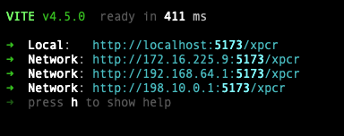
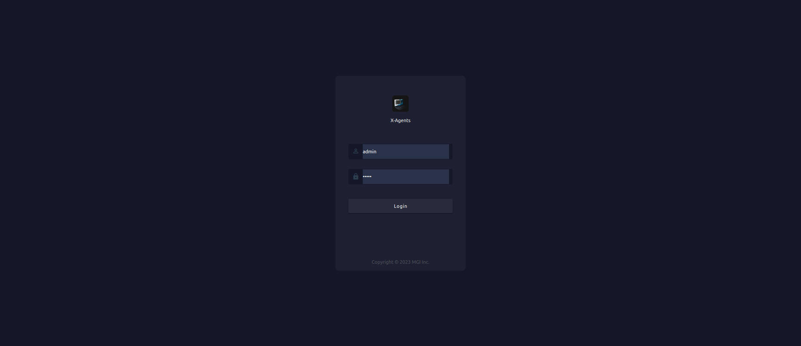
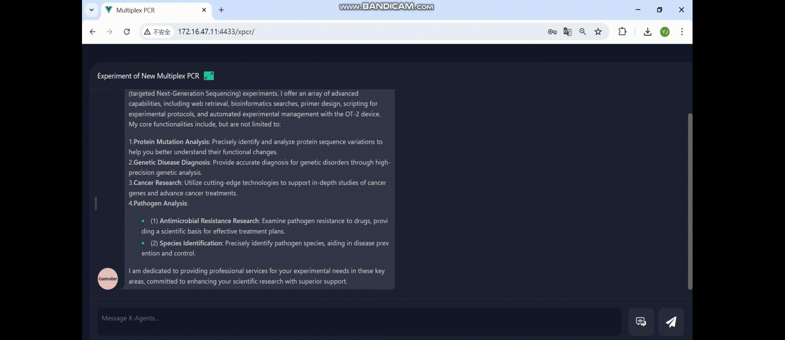
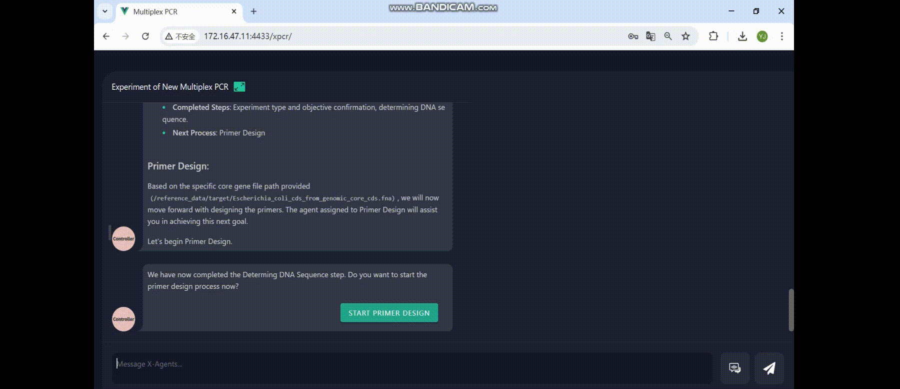

# PrimeGen
This repository contains code and tutorials for Multiplex  PCR experiment from MGI-X.
##citation
@article{PrimeGen,
  title={Accelerating primer design for amplicon sequencing orchestrated by large language model powered agents},
  author={Yi Wang, Yuejie Hou, Lin Yang, Shishen Li, Weiting Tang, Hui Tang
, Qiushun He, Siyuan 5Lin, Yanyan Zhang, Xingyu Li, Shiwen Chen, Yusheng Huang, Lingsong Kong, Duncan Yu
Feng Mu, Huanming Yang, Nattiya Hirankarn, Jian Wang, Meng Yang},
  journal={xxxx},
  doi={xxxx},
  url={x x x},
  year={2025},
  publisher={xxxx}
}

## Installation

### Environments

1. Copy example environment file `.env.example` to `.env`  
```bash
cp .env.example .env
```

2. Change environment variable as you need. 
  - DATA: set `DATA_PATH` which used to store the project files, include static, db files and upload files.
  - IMAGE: mysql and redis use official image from docker hub. mgi-x/x-pcr:latest and mgi-x/x-search:latest is used for build.
  - MYSQL: Database setting, storage information for chat message and conversation, user ect.
  - REDIS: Redis setting, store the steps and info during the chat.
  - JWT: Set the random secret for frontend.
  - **OPENAI_API**: Currently use azure openai deployment, set up `OPENAI_API_BASE`, `OPENAI_API_KEY`, `OPENAI_API_ENGINE` to use LLM. *Necessary*, Cannot use if these parameters not setup.
  - GOOGLE_SEARCH_API: Use google API to search web api, ignore if these parameters are not set.
  - XPCR_FILES: Static file path to route.
  - PROXY: Use proxy if cannot connect openai server
  - NCBI/PRIMER/PROTOCOL: Agent url, default is xsearch application
  - CODE EXECUTION:code agent to control the machine.
  - AZURE WHISPER: Voice to text server

### Docker(Recommended)

1. Build docker image  
```bash
make build
```
2. After setting the environment file, Run command  
```bash
docker compose up
```

### Local Run

1. Install modules

`make install` which actually is `yarn Install`


2. Start Mysql and Redis services, use local or start docker container  
```bash
make local_data_up
```
3. Start frontend service  
```bash
make local_client
```  


4. Start backend service   
```bash
make local_server 
 ```

5. Install python requirements and Start agent service   
5.1 Requirement

- `docker` >= 23.0.5
- `docker-compose` >= 2.17.3
- `make` >= 3.81
- `nodejs` >= 16.20.0
- `npm` >= 8.19.4
- `yarn` >= 1.22.19
- `nginx` >= 1.18.0 (Ubuntu)

The versions listed are all versions used during development. It may be okay to be lower than this version, but it has not been verified
```bash
pip install -r ./requirements.text
``` 

5.2 Start agent service
```bash
python ./src/app_dev.py
```

## primer design demo

### 1 design primer for protein mutation experiment

    python /code/src/plasmid.py --fasta_path /data/protein_data/Luc.fa  --out_path /results/ --gene_name Luc --min_amp_len 210 --max_amp_len 270 --temperature 60 --min_GC 40 --max_GC 60 --max_len 23 --start_pos 100 --end_pos 1200 


##deploy

### 1. visit

You can experience it through this website. The account and password are as follows

```
web: https://chat.mgi-tech.com/xpcr/login
```
#### 1.1 Login 
Before logging in, you can register an account and then you can enjoy it.




### 2. Conversation flow example video of Search Agent
More process instructions can be found in the folder'example'





### 3. Conversation flow example video of Primer Agent
More process instructions can be found in the folder'example'





### 4. Conversation flow example video of Protocol Agent
More process instructions can be found in the folder'example'


The code that can be executed on liquid handling robot generated by the protocol agent can be found in the'generated_executable_code' folder,and the kit instructions can be found in the 'protocol_file' folder.

### 5. The generated code running on liquid handling robot


the anomaly detection code can be found in the folder 'VLM-anomly'


