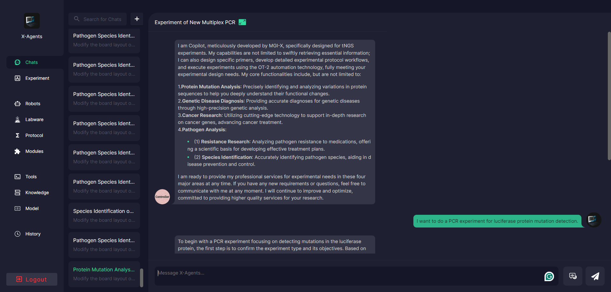
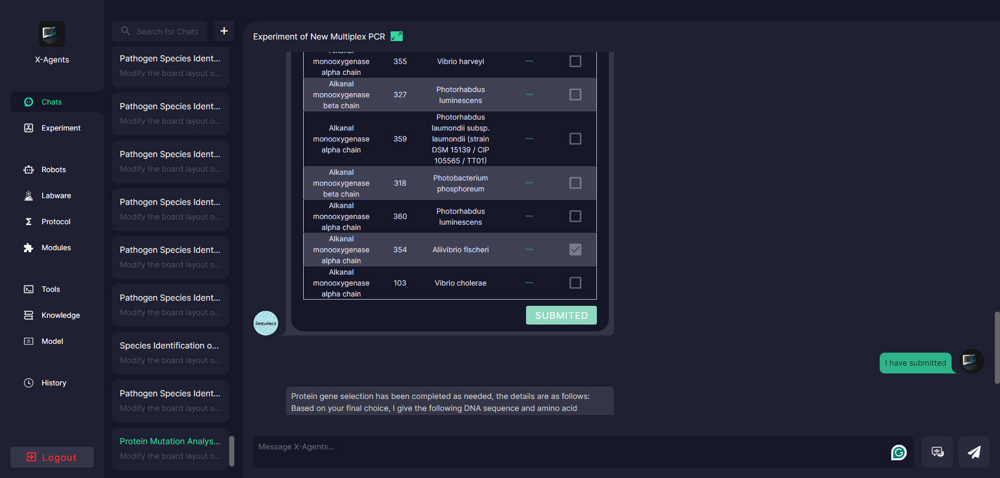

# PrimeGen
This repository contains code and tutorials for Multiplex  PCR experiment from MGI-X.

## 1. Requirement

- `docker` >= 23.0.5
- `docker-compose` >= 2.17.3
- `make` >= 3.81
- `nodejs` >= 16.20.0
- `npm` >= 8.19.4
- `yarn` >= 1.22.19
- `nginx` >= 1.18.0 (Ubuntu)

The versions listed are all versions used during development. It may be okay to be lower than this version, but it has not been verified


### 2. primer design demo


### 2.1 design primer for protein mutation experiment

    python /code/x-multiplex-pcr/seq_search/src/plasmid.py --fasta_path /data/protein_data/Luc.fa  --out_path /data/output/ --gene_name Luc
### 2.2 design primer for pathogen analysis experiment

    python /code/x-multiplex-pcr/seq_search/src/MTB_primer_design.py --fasta_path /data/protein_data/MTB.fa --snp_path /data/protein_data/MTB_target_snp.csv  --out_path /data/output/ --gene_name MTB


### 2. deploy

### 2.1 nginx config
```
server {
        listen 4433;
        server_name 172.16.47.11;
		location / {
			proxy_pass http://127.0.0.1:3001/;
					proxy_connect_timeout 300s;
					proxy_send_timeout 300s;
					proxy_read_timeout 300s;
		}	

		location /search/ {
			proxy_pass http://127.0.0.1:8082/;
			proxy_connect_timeout 300s;
			proxy_send_timeout 300s;
			proxy_read_timeout 300s;
		}	
}

```

#### 2.2. build

```bash
make build
```

#### 2.3. start

```bash
sudo bash run.sh
```

if you want stop project, you can run:
```bash
sudo bash stop.sh
```


#### 3. visit

```
web: http://localhost:4433
```
#### 3.1 Login 
Login account:

```
account: admin
password: admin
```


#### 

#### 4.Conversation flow example

4.1 Experiment of Protein Mutation Analysis of Luciferase

user: I want to do a PCR experiment for luciferase protein mutation detection.



user: i have no gene name


user choose the gene he wants(I have submitted)



user upload plasmid-modified files (I have submitted)


user: yes ，start primer design
...
user: all params use default value
...
user: ok,yes


