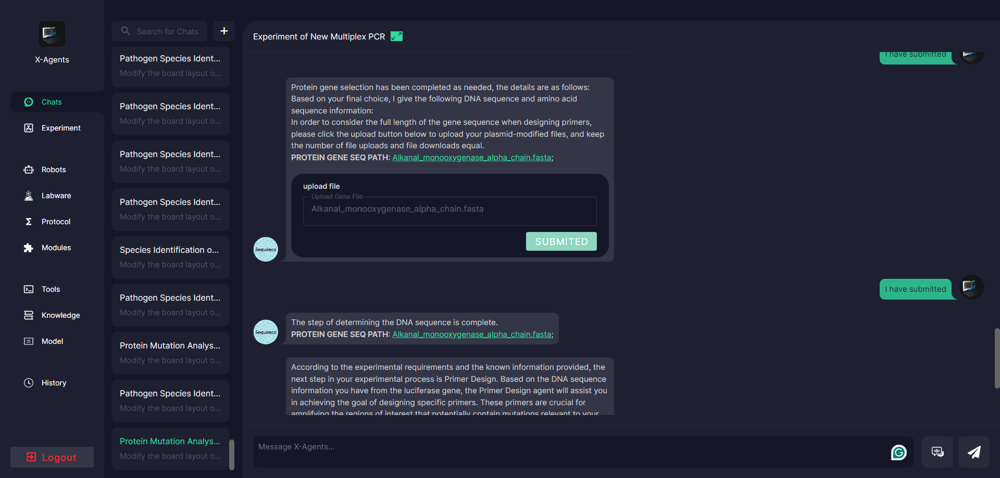

# NCBI Datasets

### 1. Environmental needs

- `docker` >= 23.0.5
- `docker-compose` >= 2.17.3
- `make` >= 3.81
- `nodejs` >= 16.20.0
- `npm` >= 8.19.4
- `yarn` >= 1.22.19
- `nginx` >= 1.18.0 (Ubuntu)

The versions listed are all versions used during development. It may be okay to be lower than this version, but it has not been verified

### 2. deploy

### 2.1 nginx config
```
server {
        listen 4433;
        server_name 172.16.47.11;
		location / {
			proxy_pass http://127.0.0.1:3001/;
					proxy_connect_timeout 300s;
					proxy_send_timeout 300s;
					proxy_read_timeout 300s;
		}	

		location /search/ {
			proxy_pass http://127.0.0.1:8082/;
			proxy_connect_timeout 300s;
			proxy_send_timeout 300s;
			proxy_read_timeout 300s;
		}	
}

```

#### 2.2. build

```bash
make build
```

#### 2.3. start

```bash
sudo bash run.sh
```

if you want stop project, you can run:
```bash
sudo bash stop.sh
```


#### 3. visit

```
web: http://localhost:4433
```
#### 3.1 Login 
Login account:

```
account: admin
password: admin
```

#### 

#### 4.Example
4.1 Experiment of Protein Mutation Analysis of Luciferase

user: I want to do a PCR experiment for luciferase protein mutation detection.


user: i have no gene name


user choose the gene he wants(I have submitted)


user upload plasmid-modified files (I have submitted)


user: yes ，start primer design
...
user: all params use default value
...
user: ok,yes


https://www.ncbi.nlm.nih.gov/datasets

This zip archive contains an NCBI Datasets Data Package.

NCBI Datasets Data Packages can include sequence, annotation and other data files, and metadata in one or more data report files.
Data report files are in JSON Lines format.

---
## FAQs
### Where is the data I requested?

Your data is in the subdirectory `ncbi_dataset/data/` contained within this zip archive.

### I still can't find my data, can you help?

We have identified a bug affecting Mac Safari users. When downloading data from the NCBI Datasets web interface, you may see only this README file after the download has completed (while other files appear to be missing).
As a workaround to prevent this issue from recurring, we recommend disabling automatic zip archive extraction in Safari until Apple releases a bug fix.
For more information, visit:
https://www.ncbi.nlm.nih.gov/datasets/docs/reference-docs/mac-zip-bug/

### How do I work with JSON Lines data reports?

Visit our JSON Lines data report documentation page:
https://www.ncbi.nlm.nih.gov/datasets/docs/v2/tutorials/working-with-jsonl-data-reports/

### What is NCBI Datasets?

NCBI Datasets is a new resource that lets you easily gather data from across NCBI databases. Find and download gene, transcript, protein and genome sequences, annotation and metadata.

### Where can I find NCBI Datasets documentation?

Visit the NCBI Datasets documentaion pages:
https://www.ncbi.nlm.nih.gov/datasets/docs/

---

National Center for Biotechnology Information
National Library of Medicine
info@ncbi.nlm.nih.gov
