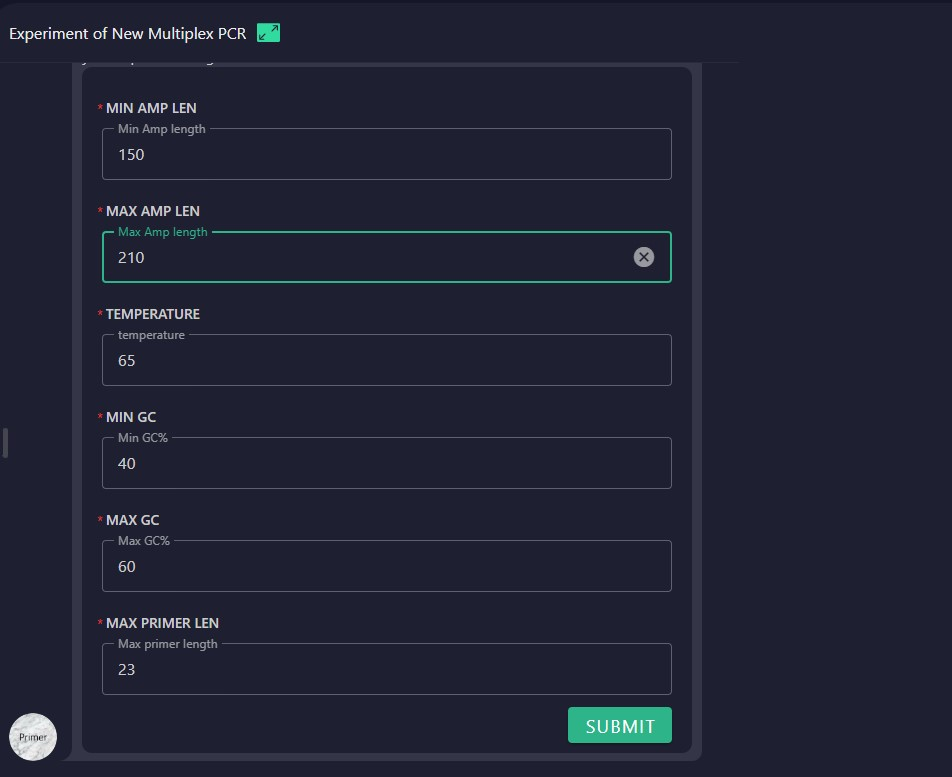

# Primer Design Guide for Cancer Analysis

## 1.	User Initiates Cancer Analysis
The user specifies the type of cancer analysis and selects the relevant cancer category.

## 2.Agent Presents Cancer Classification
The agent provides a detailed cancer classification table, allowing the user to select the specific subtype. The classification includes:
  ### Primary Site: 
  The organ or body part where the tumor originated. Identifying the primary site is essential for accurate diagnosis and treatment.Example: Lung, Breast, Colon.
  ### Site Subtype 1: 
  A more specific anatomical location within the primary site, providing a detailed description of the tumor's position.Example: If the primary site is the lung, subtypes could include the right upper lobe or left lower lobe.
  ### Primary Histology:
  The main histological characteristics or cell types of the tumor, describing its appearance under a microscope. This helps classify the tumor and understand its biological behavior and prognosis.Example: Squamous cell carcinoma, Adenocarcinoma, Lymphoma.
  ### Histology Subtype 1:
   A further classification of the tumor based on its primary histology, offering a more precise categorization of cell structure.Example: If the primary histology is adenocarcinoma, subtypes might include papillary adenocarcinoma or tubular adenocarcinoma.

## 3.Identification of Disease-Associated Genes and SNPs
After selecting the cancer subtype, the agent retrieves associated disease-causing genes and relevant SNPs for the selected cancer type. This information is used for primer design.

## 4.User Confirms Primer Design
The user confirms readiness to proceed with the primer design process.

## 5.Primer Design Parameter Confirmation
The user specifies the parameters for primer design.

## 6.Primer Sequence Generation
The workflow generates the primer sequences, completing the process.

