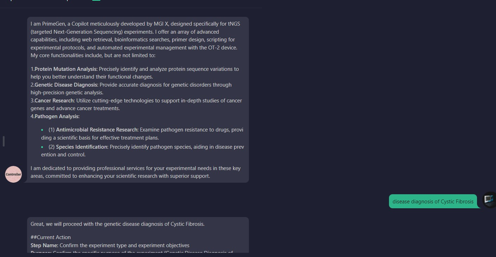
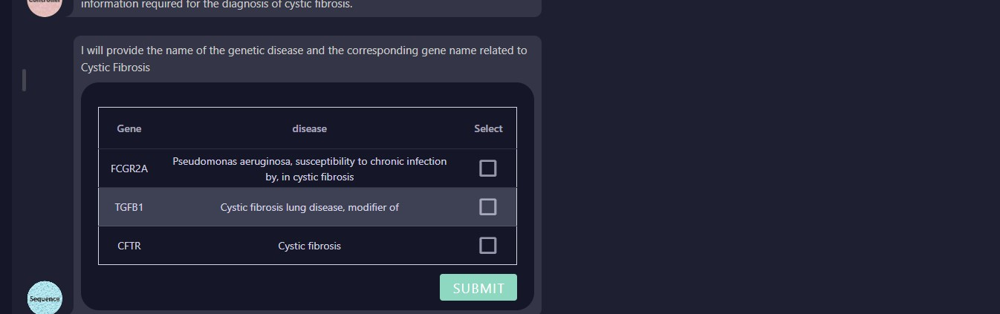
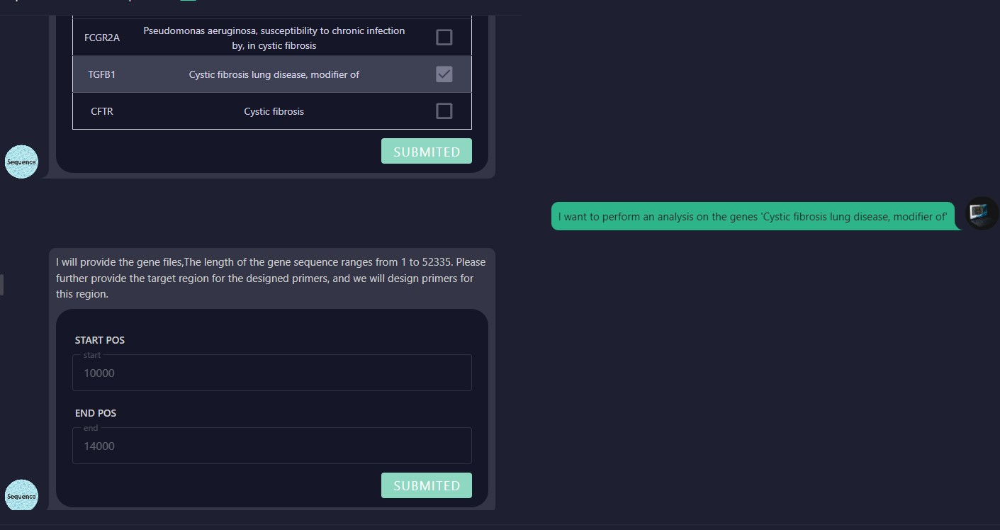
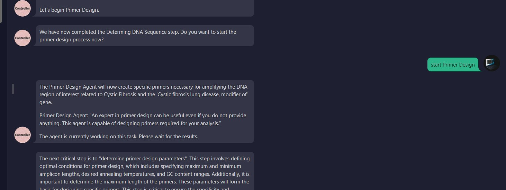
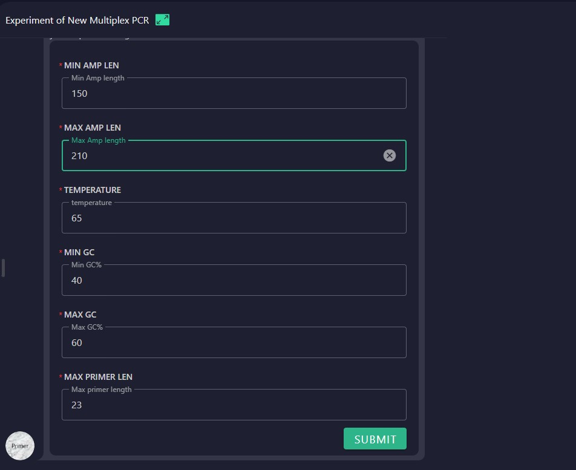

# Primer Design Guide for Genetic Disease Analysis

## 1.User Initiates Genetic Disease Analysis
The user specifies the genetic disease for analysis and provides the disease name.

## 2.Agent Searches Disease Database
The agent searches a genetic disease database using the provided name and retrieves relevant diseases and their associated causative genes.

## 3.User Selects a Disease
The user selects the disease of interest. The agent retrieves the corresponding gene sequences from the human reference genome, and the user selects the target region for primer design.

## 4.User Confirms Primer Design
The user confirms they are ready to proceed with the primer design.

## 5.User Specifies Primer Design Parameters
The user specifies the parameters for the primer design process.

## 6.Primer Design Completion
The agent generates the primer sequences and returns a CSV file containing the designed primers.

