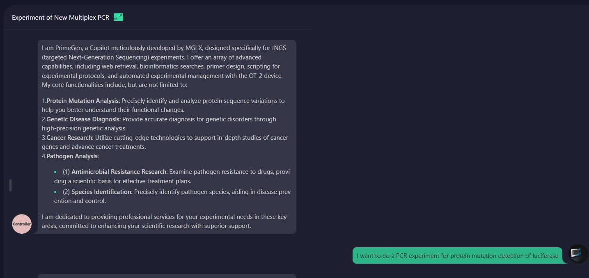
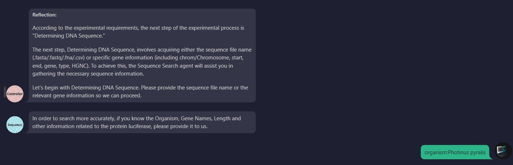
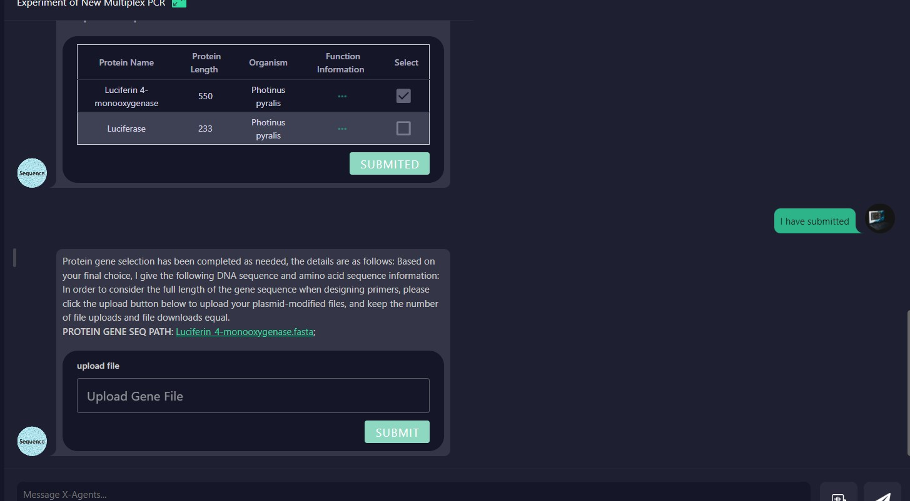
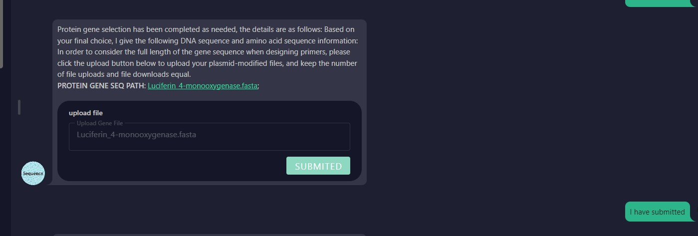
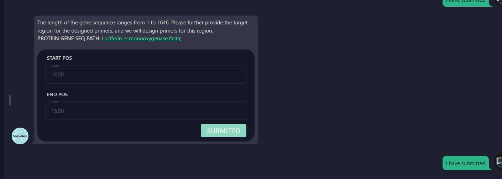
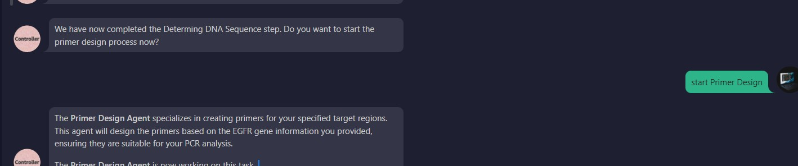
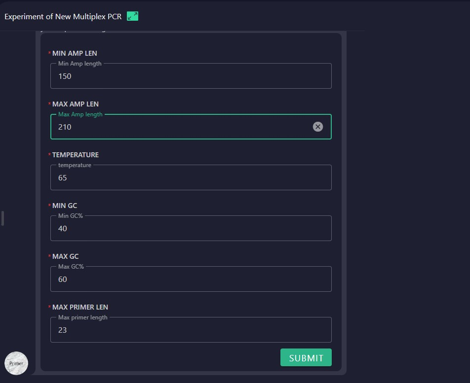
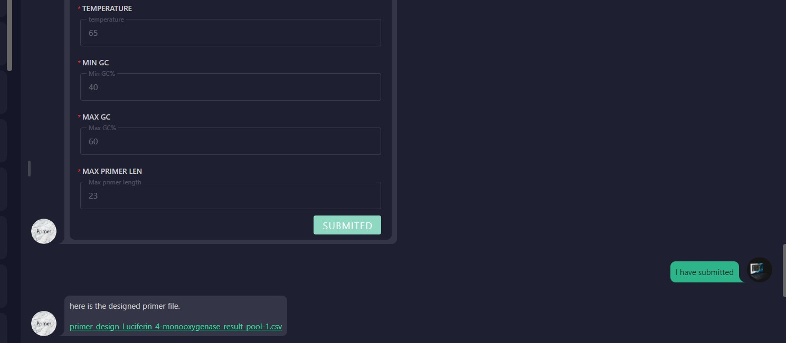

# Primer Design Guide for Protein Mutation Analysis

## 1.User Initiates Protein Mutation Analysis
The user begins by specifying the protein they want to analyze for mutations and provides the protein name.

## 2.Agent Searches UniProt Database
The agent searches the UniProt database using the provided protein name. If the user has additional information, such as organism, gene names, or sequence length, they can provide it to refine the search.

## 3.User Selects a Protein
The user selects a protein from the search results. The agent then provides a download link for the corresponding gene sequence file. The user downloads the file, modifies the sequence using plasmids, and uploads the modified sequence.

## 4.Target Region Selection for Primer Design
After uploading the modified sequence, the user selects the target region for primer design.

## 5.User Confirms Primer Design
The user confirms they are ready to begin the primer design process.

## 6.User Specifies Primer Design Parameters
The user specifies the parameters for primer design.

## 7.Primer Sequence Generation
The system generates the primer sequences and provides the output file, completing the process.

