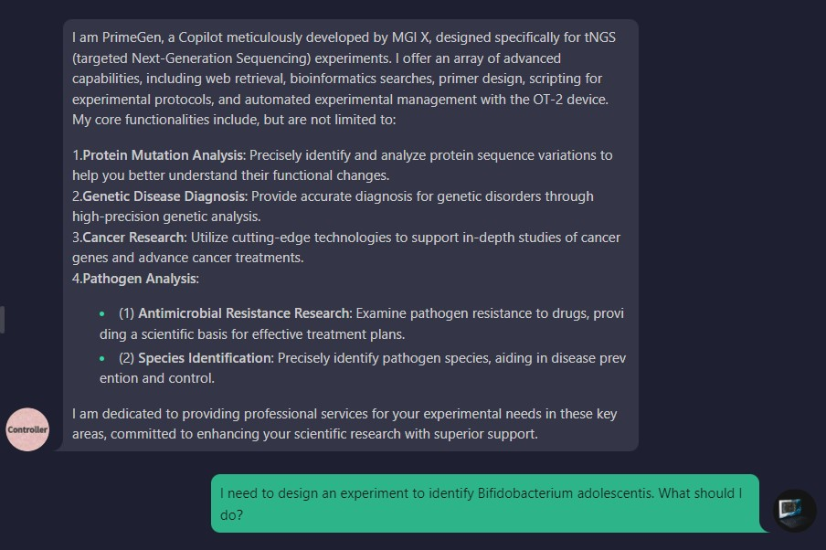
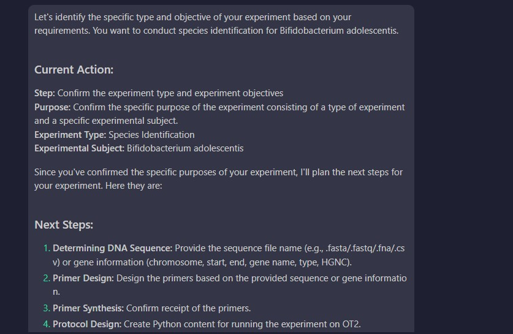
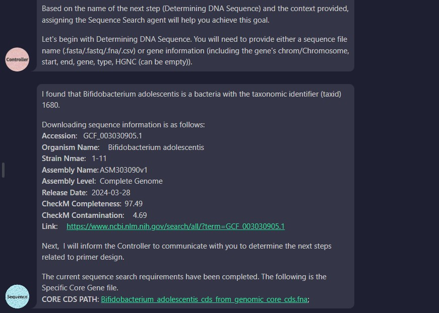
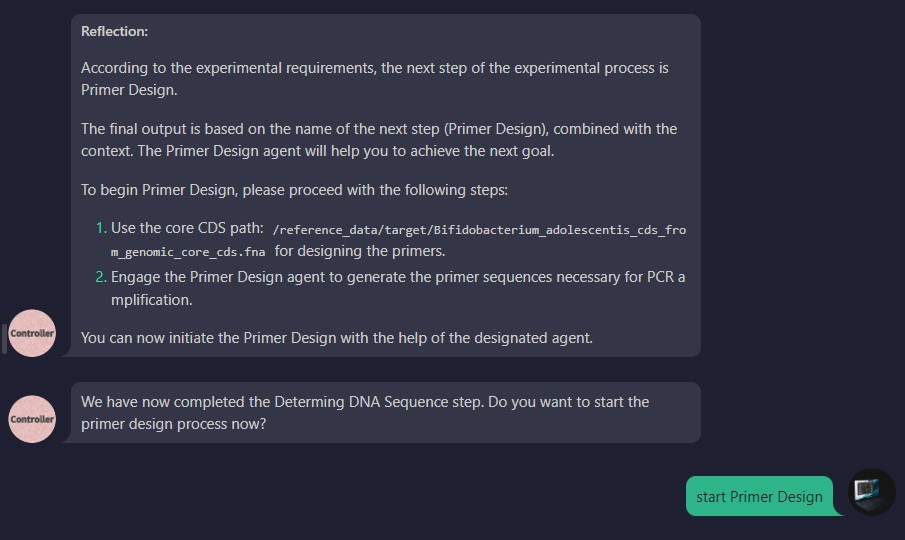
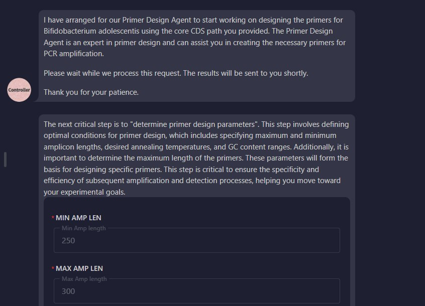
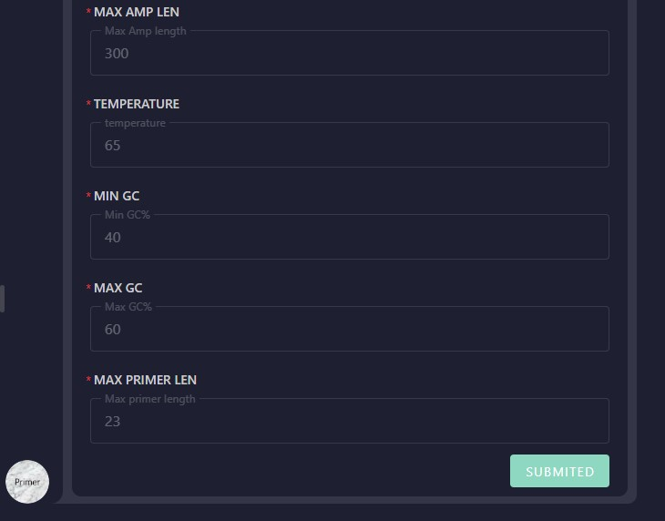
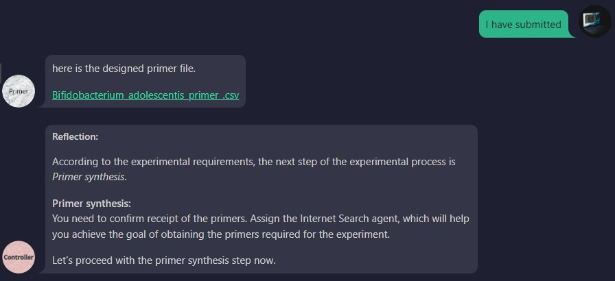

# Primer Design Guide for Species Identification

## 1.Agent Introduction
The agent introduces its functionality, and the user provides the species search request. (Note: Current limitations include lack of support for fungi and protozoa, and only partial support for species identification at the subspecies or strain level. These will be addressed in future updates.)

## 2.Agent Feedback
The agent acknowledges the request, confirms understanding, and outlines the next steps for the process.

## 3.Sequence Search
The agent searches for the relevant sequence, downloads it, and identifies the core CDS with species-specific markers.

## 4.Primer Design Confirmation
The agent prompts the user to confirm whether they are ready to initiate the primer design process.

## 5.User Input for Primer Design Parameters
The user provides the parameters for primer design. (Note: Currently, only parameter selections below the default settings are available. Future updates will enhance this feature.)

## 6.Primer Design Completion
The agent generates the primer sequences and returns a CSV file containing the designed primers.

