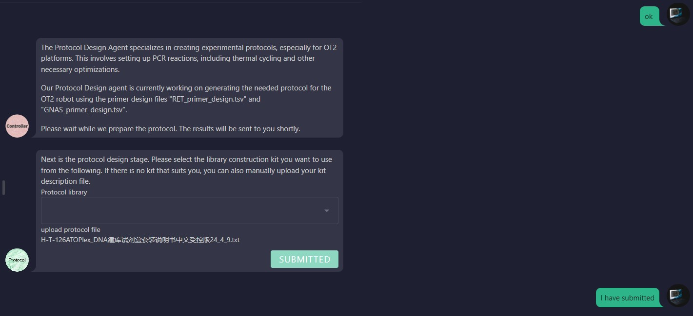

# Primer Design Guide for Protocol Design

## 1.User uploads library construction kit usage instructions document

## 2.Agent extracts the specific operation steps for constructing the Chinese database of the document and uses RAG technology to match the corresponding code blocks for each step. The user needs to confirm the matching results and upload the necessary experimental parameters.

## 3.Agent calculates the solution volume parameters used in each code block based on the experimental parameters provided by the user, and the user is required to confirm the parameters.

## 4.Agent modifies the code block according to the solution volume parameter and generates new executable code.

